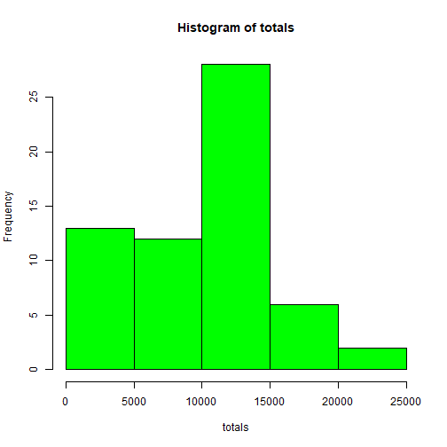
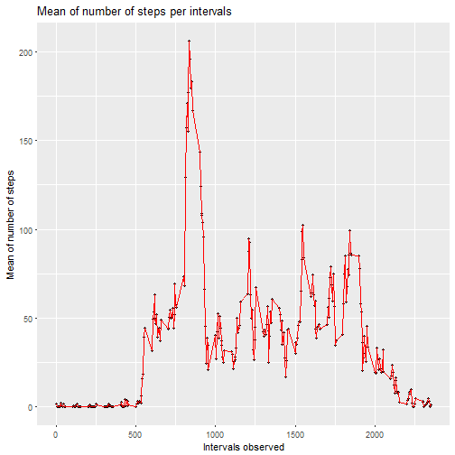
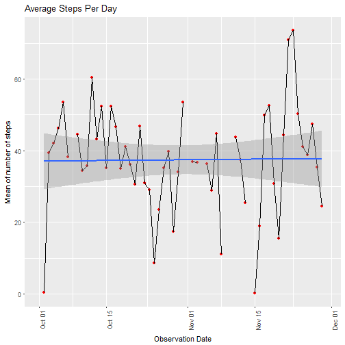
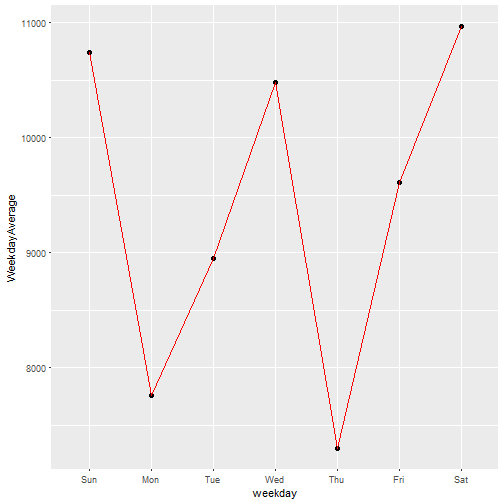
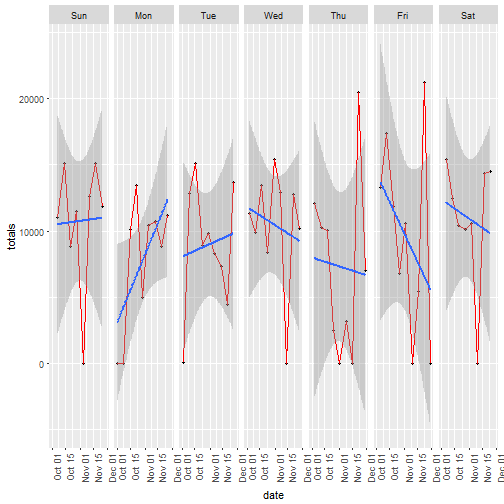
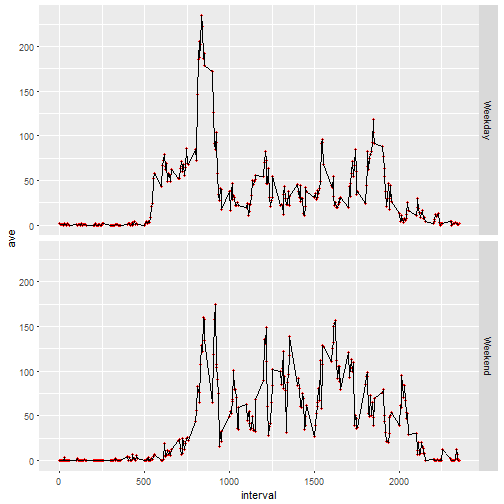
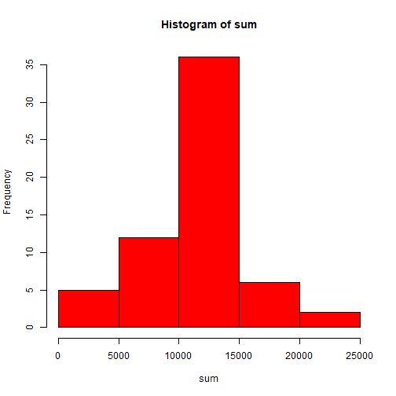

## Author : Nima Arvin

## setting the global options to show the code and results for all code chunks

```r
knitr::opts_chunk$set(echo = TRUE)
```


## Code for reading in the dataset and/or processing the data


```r
library(knitr)
library(lubridate)
wd <- getwd()
zipfile <-download.file("https://d396qusza40orc.cloudfront.net/repdata%2Fdata%2Factivity.zip",destfile=paste0(wd,"/file.zip")) 
unzip(paste0(wd,"/file.zip"))
maindata <- read.csv(paste0(wd,"/activity.csv"), header = TRUE)
maindata$date <- ymd(maindata$date)
summary(maindata)
```

```
##      steps             date               interval     
##  Min.   :  0.00   Min.   :2012-10-01   Min.   :   0.0  
##  1st Qu.:  0.00   1st Qu.:2012-10-16   1st Qu.: 588.8  
##  Median :  0.00   Median :2012-10-31   Median :1177.5  
##  Mean   : 37.38   Mean   :2012-10-31   Mean   :1177.5  
##  3rd Qu.: 12.00   3rd Qu.:2012-11-15   3rd Qu.:1766.2  
##  Max.   :806.00   Max.   :2012-11-30   Max.   :2355.0  
##  NA's   :2304
```

```r
str(maindata)
```

```
## 'data.frame':	17568 obs. of  3 variables:
##  $ steps   : int  NA NA NA NA NA NA NA NA NA NA ...
##  $ date    : Date, format: "2012-10-01" "2012-10-01" ...
##  $ interval: int  0 5 10 15 20 25 30 35 40 45 ...
```


## Daily Activity Pattern

### What is mean total number of steps taken per day?

```r
library(dplyr)
gdata <- group_by(maindata, date)
dailymeans<- summarise(gdata, mean=mean(steps, na.rm = TRUE))
dailymeans
```

```
## # A tibble: 61 x 2
##    date          mean
##    <date>       <dbl>
##  1 2012-10-01 NaN    
##  2 2012-10-02   0.438
##  3 2012-10-03  39.4  
##  4 2012-10-04  42.1  
##  5 2012-10-05  46.2  
##  6 2012-10-06  53.5  
##  7 2012-10-07  38.2  
##  8 2012-10-08 NaN    
##  9 2012-10-09  44.5  
## 10 2012-10-10  34.4  
## # ... with 51 more rows
```

### Median number of steps taken each day

```r
dailymedians<- summarise(gdata, mean=median(steps, na.rm = TRUE))
dailymedians
```

```
## # A tibble: 61 x 2
##    date        mean
##    <date>     <dbl>
##  1 2012-10-01    NA
##  2 2012-10-02     0
##  3 2012-10-03     0
##  4 2012-10-04     0
##  5 2012-10-05     0
##  6 2012-10-06     0
##  7 2012-10-07     0
##  8 2012-10-08    NA
##  9 2012-10-09     0
## 10 2012-10-10     0
## # ... with 51 more rows
```

### Total number of steps taken per day

```r
dailytotals <- summarise(gdata, totals=sum(steps, na.rm = TRUE))
dailytotals
```

```
## # A tibble: 61 x 2
##    date       totals
##    <date>      <int>
##  1 2012-10-01      0
##  2 2012-10-02    126
##  3 2012-10-03  11352
##  4 2012-10-04  12116
##  5 2012-10-05  13294
##  6 2012-10-06  15420
##  7 2012-10-07  11015
##  8 2012-10-08      0
##  9 2012-10-09  12811
## 10 2012-10-10   9900
## # ... with 51 more rows
```

### Histogram of the total number of steps taken each day

```r
with(dailytotals,hist(totals, col = "green"))
```



### Mean and Median of the total number of steps taken per day

```r
### Mean of total number of steps per day
mean(dailytotals$totals)
```

```
## [1] 9354.23
```

```r
### Median of total number of steps per day
median(dailytotals$totals)
```

```
## [1] 10395
```


### Time series plot of the 5 minutes interval


```r
library(dplyr)
library(ggplot2)
gidata <- group_by(maindata, interval)
intervalmeans <- summarize(gidata, intmeans=mean(steps, na.rm = TRUE))
intervalmeans
```

```
## # A tibble: 288 x 2
##    interval intmeans
##       <int>    <dbl>
##  1        0   1.72  
##  2        5   0.340 
##  3       10   0.132 
##  4       15   0.151 
##  5       20   0.0755
##  6       25   2.09  
##  7       30   0.528 
##  8       35   0.868 
##  9       40   0     
## 10       45   1.47  
## # ... with 278 more rows
```

```r
g2 <- ggplot(intervalmeans, aes(interval, intmeans, group=1))
g2+geom_point(col="black", size=1)+geom_line(col="red")+labs(title="Mean of number of steps per intervals", x="Intervals observed", y="Mean of number of steps")
```



### Which 5-minute interval, on average across all the days in the dataset, contains the maximum number of steps?

```r
intervalmeans[intervalmeans[,2]==max(intervalmeans[,2]),]
```

```
## # A tibble: 1 x 2
##   interval intmeans
##      <int>    <dbl>
## 1      835     206.
```


### Time series plot of the average number of steps taken

```r
g <- ggplot(dailymeans, aes(date,mean, group=1))
g + geom_point(col="red")+ geom_line()+geom_smooth(method = "glm", na.rm = TRUE)+ theme(axis.text.x = element_text(angle = 90, hjust = 1))+labs(title="Average Steps Per Day",x="Observation Date",y="Mean of number of steps" )
```

```
## Warning: Removed 8 rows containing missing values (geom_point).
```

```
## Warning: Removed 2 rows containing missing values (geom_path).
```



### Are there differences in activity patterns between weekdays and weekends?

```r
library(lubridate)
dailytotals$weekday <- wday(dailytotals$date, label = TRUE)
wdg <- group_by(dailytotals, weekday)
weekdayavg <- summarize(wdg, WeekdayAverage=mean(totals, na.rm = TRUE))
g3 <- ggplot(weekdayavg, aes(weekday,WeekdayAverage, group=1))
g3+geom_point(col="black", size=2)+geom_line(col="red")
```




### How did the weekdays trend looked like over time ?

```r
dailytotals$weekday <- wday(dailytotals$date, label = TRUE)
g1 <- ggplot(dailytotals, aes(date, totals, group=weekday))
g1+geom_point(size=1, col="black")+geom_line(col="red")+facet_grid(.~weekday)+theme(axis.text.x = element_text(angle = 90, hjust = 1))+geom_smooth(method = "lm")
```




### Panel plot comparing the average number of steps taken per 5-minute interval across weekdays and weekends

```r
day <- weekdays(maindata$date)
daylevel <- vector()
for (i in 1:nrow(maindata)) {
    if (day[i] == "Saturday") {
        daylevel[i] <- "Weekend"
    } else if (day[i] == "Sunday") {
        daylevel[i] <- "Weekend"
    } else {
        daylevel[i] <- "Weekday"
    }
}
maindata$daylevel <- daylevel
maindata$daylevel <- factor(maindata$daylevel)

gint <- group_by(maindata, daylevel, interval)
aint <- summarize(gint,ave=mean(steps, na.rm = TRUE) )


g4 <- ggplot(aint, aes(interval, ave, group=1))
g4+geom_point(size=1, col="red")+ geom_line(col="black")+facet_grid(daylevel~.)
```




## Imputing missing values

### Calculate and report the total number of lines with missing values in the dataset

```r
sum(is.na(maindata))
```

```
## [1] 2304
```

### Get a report of the columns that have missing values

```r
summary(is.na(maindata))
```

```
##    steps            date          interval        daylevel      
##  Mode :logical   Mode :logical   Mode :logical   Mode :logical  
##  FALSE:15264     FALSE:17568     FALSE:17568     FALSE:17568    
##  TRUE :2304
```


### Code to describe and show a strategy for imputing missing data

1. The strategy will be to substitude the missing value with the mean of the number of steps for that interval

```r
z <- aggregate(steps~ interval, data = maindata,mean)
for (i in 1:nrow(maindata)) {
    if (is.na(maindata$steps[i])) {
        maindata$steps[i] <- z[z[,1]==maindata$interval[i],2]
    }
}
maindata.no.missing <- maindata
summary(is.na(maindata.no.missing))
```

```
##    steps            date          interval        daylevel      
##  Mode :logical   Mode :logical   Mode :logical   Mode :logical  
##  FALSE:17568     FALSE:17568     FALSE:17568     FALSE:17568
```


### Histogram of the total number of steps taken each day after missing values are imputed

```r
ggroup <- summarise(group_by(maindata.no.missing, date),sum=sum(steps, na.rm = TRUE))
with(ggroup, hist(sum, col = "red"))
```




